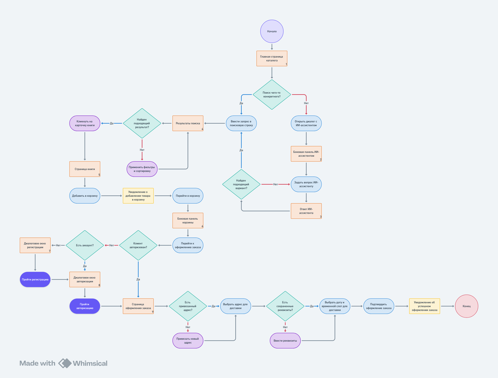
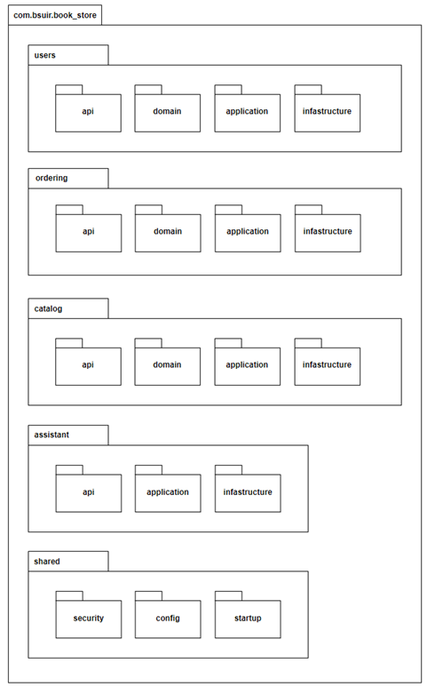
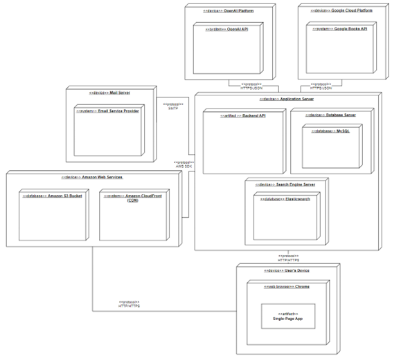
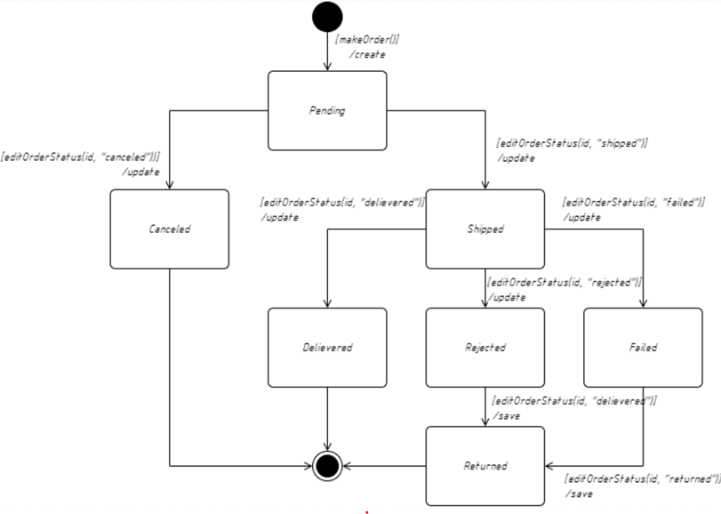
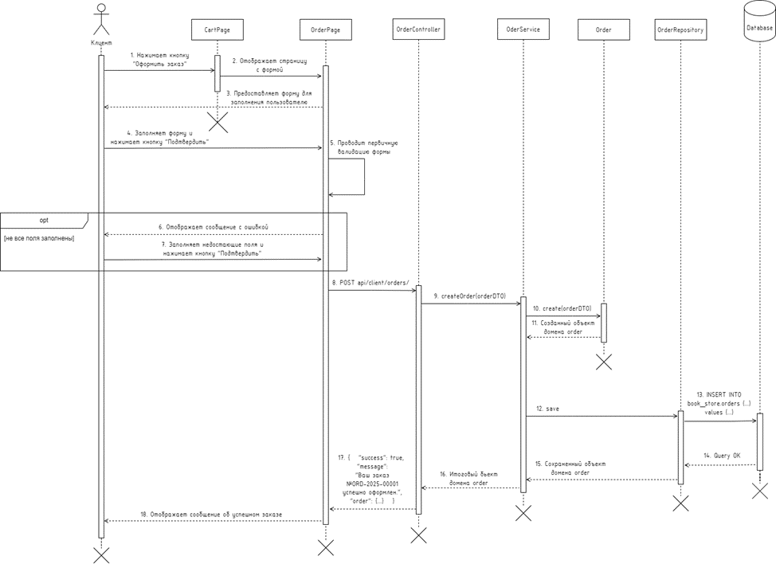
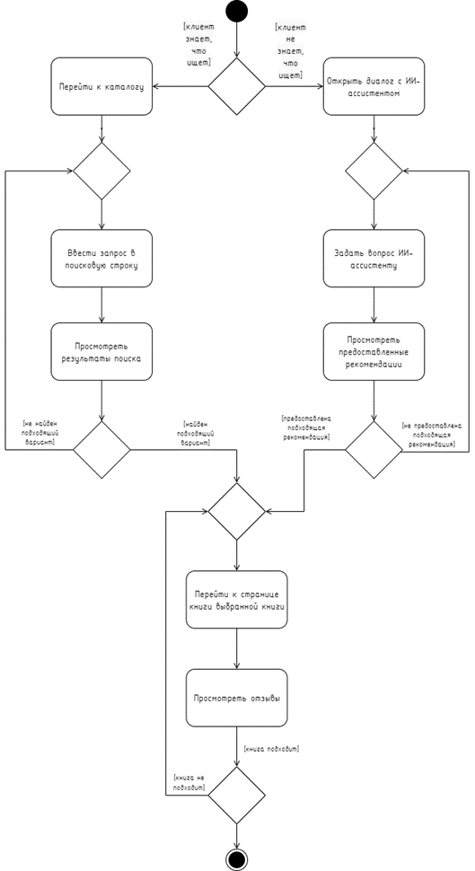
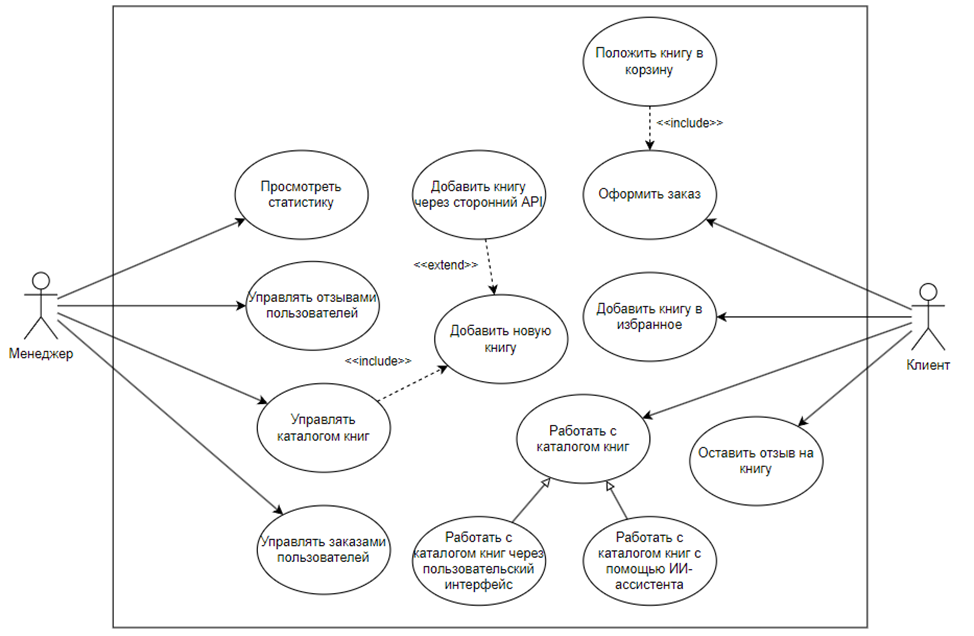

# **BookStore**

Проект представляет собой полнофункциональное веб-приложение для книжного интернет-магазина, ключевой особенностью которого является интегрированный ИИ-ассистент для семантического поиска и подбора книг.

Цель проекта — предложить решение классической проблемы пользователей: поиск книг по нечётким, описательным запросам. В дополнение к традиционному поиску по ключевым словам, интернет-магазин также предлагает интуитивный диалог с ИИ-ассистентом, который понимает смысл и контекст запроса, помогая читателям находить идеальные книги, даже не зная их точного названия или автора.

#### Основные возможности
* **Интеллектуальный поиск с ИИ-ассистентом:**
  * **Семантический поиск:** Возможность искать книги по описанию сюжета, настроению, атмосфере или просто "похожие на..." (реализовано с помощью паттерна RAG - Retrieval-Augmented Generation).
  * **Диалоговый интерфейс:** Общение с чат-ботом, который может отвечать на структурированные вопросы о каталоге (например, "какая книга самая популярная?" или "покажи отзывы") благодаря использованию инструментов (Tools).

* **Классический поиск:**
  * Быстрый полнотекстовый поиск по каталогу (название, автор) с использованием Elasticsearch для обеспечения высокой релевантности и скорости ответа.
* **Управление каталогом:**
  * Просмотр, добавление и редактирование книг в административной панели.
  * **Автоматический импорт данных:** Интеграция с **Google Books API** для быстрого добавления новых книг в каталог по названию или ISBN.


* **Пользовательский функционал:**
  * Просмотр детальной информации о каждой книге.
  * Оформление заказа.


* **Функционал менеджера:**
  * Управление заказами.
  * Просмотр статистики по продажам.

#### Сервер: https://github.com/Helltu/BookStoreServer
#### Клиент: https://github.com/Helltu/BookStoreClient

---

## **Содержание**

1. [Архитектура](#архитектура)
    1. [C4-модель](#c4-модель)
    2. [Схема данных](#схема-данных)
2. [Функциональные возможности](#функциональные-возможности)
    1. [Диаграмма вариантов использования](#диаграмма-вариантов-использования)
    2. [User-flow диаграммы](#user-flow-диаграммы)
3. [Пользовательский интерфейс](#пользовательский-интерфейс)
   1. [Примеры экранов UI](#примеры-экранов-ui)
4. [Детали реализации](#детали-реализации)
    1. [UML-диаграммы](#uml-диаграммы)
    2. [Спецификация API](#спецификация-API)
    3. [Безопасность](#безопасность)
    4. [Оценка качества кода](#оценка-качества-кода)
5. [Тестирование](#тестирование)
    1. [Unit-тесты](#unit-тесты)
    2. [Интеграционные тесты](#интеграционные-тесты)
6. [Установка и запуск](#установка-и-запуск)
    1. [Манифесты для сборки docker образов](#манифесты-для-сборки-docker-образов)
7. [Лицензия](#лицензия)
8. [Контакты](#контакты)

---
## **Архитектура**

### C4-модель


Представленная диаграмма является самым высокоуровневым представлением архитектуры и определяет место проектируемого программного средства в его экосистеме. Диаграмма наглядно демонстрирует границы системы, ее основных пользователей и ключевые зависимости от внешних программных систем.

Центральным элементом диаграммы является разрабатываемое программное средство – «Интернет-магазин». Это веб-приложение, спроектированное для того, чтобы предоставить покупателям инновационный способ поиска книг, а менеджерам – удобные инструменты для управления магазином.

С программным средством взаимодействуют два типа пользователей. Основным является покупатель, который использует публичный веб-интерфейс, чтобы искать книги и оформлять заказы. Для внутренних бизнес-процессов предусмотрена роль менеджера – сотрудника компании, который через административную панель управляет каталогом книг и заказами, а также имеет возможность просмотра статистики.

Для реализации своей ключевой функциональности программное средство тесно интегрировано с рядом внешних сервисов. Для обеспечения интеллектуального поиска и работы ИИ-ассистента, программное средство обращается к внешнему провайдеру языковых моделей – OpenAI API, чтобы генерировать ответы и обрабатывать запросы на естественном языке. Процесс наполнения каталога автоматизирован за счет взаимодействия с Google Books API, откуда система импортирует подробную информацию о книгах. Для коммуникации с пользователями, например, для отправки подтверждения о создании заказа, система использует внешний почтовый сервер (Mail Server), который отправляет email-уведомления и доставляет их в почтовый ящик покупателя.


Данная диаграмма детализирует внутреннюю структуру программного средства, раскрывая его высокоуровневую архитектуру. Она показывает основные исполняемые единицы и хранилища данных (контейнеры), из которых состоит программное средство, их технологический стек и принципы взаимо-действия.

Архитектура программного средства основана на разделении клиентской и серверной частей. Пользователи, как покупатель, так и менеджер, взаимодействуют с программным средством через SPA (Single-Page Application) – клиентское приложение, работающее в их веб-браузере. Этот контейнер, разработанный с использованием React, отвечает за весь пользовательский интерфейс и отправляет REST API запросы на сервер.

Все запросы от SPA обрабатываются центральным контейнером – Backend API. Это серверное приложение, написанное на Java с использованием фреймворка Spring Boot, является «мозгом» всего программного средства. Оно реализует всю бизнес-логику, управляет данными и координирует взаимодействие с другими контейнерами и внешними системами.

Для хранения данных используются два специализированных контейнера. Primary Database, реализованная на базе MySQL, выступает в роли основного хранилища и «источником правды». Она хранит всю структурированную информацию о пользователях, книгах, заказах и отзывах. Backend API выполняет транзакционные операции с этой базой данных с использованием технологии JDBC. В свою очередь, для реализации продвинутых поисковых возможностей используется отдельный контейнер – Search Engine, реализованный на базе Elasticsearch. Он хранит денормализованные данные о книгах, оптимизированные для быстрого поиска как по ключевым словам, так и по векторам для семантического поиска. Backend API при обращении к данному контейнеру отвечает за выполнение поисковые запросов.

Backend API также является точкой интеграции с внешними системами. Для обеспечения работы ИИ-ассистента он обращается к OpenAI API, для наполнения каталога – к Google Books API, откуда импортирует подробную информацию о книгах, а для отправки уведомлений – к внешнему Mail Server (по протоколу SMTP).


Данная диаграмма детализирует внутреннюю архитектуру ключевого контейнера системы – Backend API. Она раскрывает его внутреннюю структуру, показывая основные логические компоненты, их обязанности и технологическую реализацию, а также то, как они взаимодействуют для выполнения бизнес-задач.

Взаимодействие с внешним миром начинается с компонента REST API Controllers. Этот компонент, реализованный на базе Spring MVC, служит точкой входа для всех запросов от клиентского приложения SPA. Его основная задача – принимать HTTP-запросы, проводить их первичную валидацию и передавать запросы на выполнение соответствующим компонентам прикладного уровня.

Для реализации пользовательских сценариев, не связанных с ИИ, используется компонент Application Services. Этот тонкий слой координирует выполнение бизнес-операций. Он выполняет бизнес-логику, обращаясь к компоненту Domain Model, где инкапсулированы все бизнес-правила согласно принципам Domain-Driven Design (DDD). Для сохранения и извлечения данных агрегатов Application Services сохраняют и извлекают данные, используя компонент Repositories (JPA), который абстрагирует работу с Primary Database (MySQL).

Вся логика, связанная с ИИ-ассистентом, инкапсулирована в компоненте AI Assistant Facade. Он получает запросы от контроллеров и, в зависимости от их характера, использует либо семантический поиск, либо «агентный» подход. Для семантического поиска AI Assistant Facade выполняет семантический поиск, обращаясь к компоненту Search Client. Search Client, в свою очередь, получает ответы на поисковые запросы, взаимодействуя с контейнером Search Engine. Для обогащения ответа AI Assistant Facade получает детали о найденных книгах, используя Repositories (JPA).

Для ответов на структурированные, фактические запросы (например, «какая книга самая популярная?» или «какие отзывы у книги...») AI Assistant Facade использует «агентный» подход. В этом сценарии ИИ-ассистент выступает в роли «диспетчера»: он анализирует запрос пользователя и определяет, какой из методов-инструментов, предоставленных компонентом BooksTool, необходимо вызвать для получения ответа. BooksTool, в свою очередь, выполняет конкретную бизнес-операцию, взаимодействуя с Repositories (JPA) для получения точных данных из Primary Database. Полученный от инструмента результат затем используется ИИ-ассистентом для формирования финального, осмысленного ответа пользователю.

Взаимодействие со всеми внешними системами изолировано в отдельных компонентах. External API Clients, реализованные на базе Spring WebClient, выполняют API-вызовы к OpenAI API и Google Books API, чтобы получать векторы и генерировать ответы или импортировать информацию о книгах. Компонент Email Service отвечает за отправку уведомлений: Application Services отправляют email-уведомления, используя этот сервис, который, в свою очередь, взаимодействует с внешним Mail Server.

Такая компонентная структура четко разделяет обязанности, изолирует бизнес-логику от инфраструктурных деталей и обеспечивает высокую модульность и тестируемость программного средства.


Данная диаграмма представляет собой детализацию компонентного уровня и раскрывает внутреннюю структуру ключевого компонента AI Assistant Facade. Она соответствует упрощенной диаграмме классов в нотации UML и предназначена для разъяснения, как именно реализована сложная логика ИИ-ассистента на уровне кода, какие классы и интерфейсы задействованы и как они взаимодействуют.

Был выбран именно компонент AI Assistant Facade, поскольку он является ядром инновационной функциональности программного средства и обладает наибольшей архитектурной сложностью. В отличие от других компонентов, его реализация нетривиальна и включает в себя организацию множества взаимодействий между различными частями системы для реализации ключевой функциональности. Диаграмма кодового уровня для этого компонента имеет наивысшую ценность, так как она визуализирует неочевидную внутреннюю логику, демонстрируя, как именно сосуществуют и координируются механизмы Retrieval-Augmented Generation (RAG) для семантического поиска и механизм вызова сервисных функций для структурированных запросов. Таким образом, детализация AI Assistant Facade превращает «черный ящик» ИИ-логики в понятную схему, что критически важно для понимания самой сложной и уникальной части программного средства.

Центральным элементом является класс AiAssistantFacade, который служит точкой входа и делегирует выполнение задач двум разным механизмам в зависимости от типа запроса пользователя.

Первый механизм представлен интерфейсом Assistant, который отвечает за обработку структурированных запросов путем вызова предопределенных функций. Его реализация, создаваемая с помощью библиотеки Langchain4j, использует класс BooksTool, предоставляющий набор конкретных методов-инструментов для получения фактической информации из базы данных.

Второй механизм – ConversationalRetrievalChain – это класс, реализующий подход Retrieval-Augmented Generation (RAG) для семантического поиска по описательным запросам. Для своей работы он зависит от интерфейса ContentRetriever, который отвечает за извлечение релевантного контекста.

Создание и конфигурация этих сложных объектов инкапсулированы в классе AiConfig. Этот класс действует как «фабрика», которая собирает все необходимые зависимости для построения Assistant и ConversationalRetrievalChain. Он зависит от набора ключевых интерфейсов-абстракций Langchain4j:
- ChatLanguageModel: контракт для взаимодействия с чат-моделью;
- EmbeddingModel: контракт для преобразования текста в векторы;
- EmbeddingStore: контракт для взаимодействия с векторным хранилищем.

Эти интерфейсы являются «портами», реализации которых предоставляются другими компонентами системы (External API Clients и Search Client), что позволяет компоненту AI Assistant Facade оставаться независимым от конкретных внешних технологий. Также для управления диалогами AiAssistantFacade использует интерфейс ChatMemoryProvider.

Таким образом, кодовый уровень диаграммы наглядно демонстрирует, как с помощью принципа инверсии зависимостей и четкого разделения обязанностей между классами реализуется сложная, но модульная и расширяемая архитектура ИИ-ассистента.

### Схема данных

Ниже представлена физическая схема спроектированной базы данных.


---

## **Функциональные возможности**

### Диаграмма вариантов использования

Диаграмма вариантов использования и ее описание

### User-flow диаграммы

Ниже представлена user-flow диаграмма для клиента.


Для детального анализа пользовательского взаимодействия для роли клиента была построена user-flow диаграмма, иллюстрирующая путь покупателя от поиска подходящей книги до успешного оформления заказа. Был вы-бран именно этот сценарий, поскольку он является ключевым бизнес-процессом всего программного средства. Эта диаграмма наглядно демонстрирует все шаги, которые проходит клиент для достижения своей основной цели. Анализ этого пути позволит выявить потенциальные «узкие места» и спроектировать максимально оптимальный и бесшовный пользовательский опыт.

Данный пользовательский путь начинается на главной странице каталога, где клиент принимает первое решению: знает ли он, что ищет, или ему нужна помощь в выборе. Если клиент ищет что-то конкретное, он вводит запрос в поисковую строку. В случае, если результаты найдены, он переходит к их изучению. Если же поиск не дал результатов или оказался неточным, клиент может применить фильтры и сортировку, чтобы уточнить выборку. В качестве альтернативы, если клиент не уверен в своем выборе, он может обратиться к ИИ-ассистенту, задав ему вопрос в свободной форме и получив в ответ персонализированную рекомендацию.

После того как подходящая книга найдена в результатах поиска, клиент кликает на ее карточку и переходит на страницу детального просмотра, где изучает всю необходимую информацию. На этом этапе он может добавить книгу в корзину, после чего ему придет уведомление об ее успешном добавлении, и он сможет либо продолжить покупки, либо перейти в корзину. В боковой панели корзины клиент проверяет состав заказа и инициирует переход к финальному этапу – оформлению заказа.

Именно на этом этапе происходит ветвление, связанное с аутентификацией – происходит проверка на авторизацию клиента. Если он не авторизован, ему предлагается выбор: пройти быструю регистрацию или войти в существующий аккаунт. После успешной аутентификации клиент попадает на страницу оформления заказа. Здесь ему снова предлагается выбор: использовать один из сохраненных адресов или, если его нет, ввести новые реквизиты для доставки. После заполнения всех необходимых данных и выбора времени доставки клиент видит финальное подтверждение и завершает процесс. Путь заканчивается получением уведомления об успешном оформлении заказа, что является конечной точкой данного пользовательского сценария.

Ниже представлена user-flow диаграмма для менеджера.


Для детального анализа пользовательского взаимодействия для роли менеджера была построена user-flow диаграмма, иллюстрирующая путь менеджера при добавлении новой книги в каталог, как наиболее сложный и функционально насыщенный сценарий. Эта диаграмма наглядно демонстрирует, как менеджер взаимодействует с программным средством для выполнения своей ключевой задачи и показывает все основные ветвления и шаги, в том числе и использование интеграции с внешним сервисом.

Данный пользовательский путь начинается с авторизации, после чего менеджер попадает на главную страницу каталога. Здесь он инициирует процесс, переходя к добавлению новой книги, при этом на данном этапе ему предлагается выбор способа добавления книги – через API или с нуля.

При выборе способа добавления через API, менеджер попадает в диалоговое окно поиска, где вводит ISBN или название искомой книги, после чего выполняется поиск, и в зависимости от его результата поток разветвляется: если соответствующие книги найдены, менеджер видит их список, выбирает один из результатов, и переходит на форму редактирования с импортированными данными; если же книги не найдены, показывается соответствующее уведомление, и менеджеру предлагается повторить поиск или перейти к ручному добавлению с нуля.

При выборе пути способа добавления с нуля или после неудачного поиска через API, менеджер попадает на пустую форму редактирования книги, где он заполняет все необходимые поля вручную. В случае с импортированными данными, менеджер проверяет их (при необходимости изменяя) и заполняет недостающие внутренние поля, такие как цена и количество. Оба пути сходятся на общем шаге – загрузке изображений (превью, обложки и страниц предпросмотра). После того как все данные готовы, менеджер сохраняет книгу.

Процесс завершается тем, что менеджеру показывается уведомление об успешном добавлении новой книги и он перенаправляется обратно на главную страницу каталога, где он может видеть только что добавленную книгу в общем списке, что является логической конечной точкой данного сценария.

---

## **Пользовательский интерфейс**

### Примеры экранов UI


---

## **Детали реализации**

### UML-диаграммы

Первой к рассмотрению станет UML-диаграмма пакетов, она представ-лена на рисунке ниже.



Представленная UML-диаграмма пакетов демонстрирует высокоуровневую статическую структуру кодовой базы бекенд части будущего программного средства. Архитектура организована в соответствии с гибридным подходом, сочетающим группировку по бизнес-доменам («пакеты по фичам») и разделение по архитектурным слоям, что соответствует принципам Чистой Архитектуры и Domain-Driven Design (DDD). Такой подход обеспечивает высокую модульность, слабую связанность и ясное разделение ответственности, что упрощает дальнейшую разработку, тестирование и поддержку программного средства.

Основная структура проекта разделена на несколько пакетов верхнего уровня, каждый из которых инкапсулирует отдельную бизнес-возможность. Выделены следующие ключевые домены: `users` (управление пользователями и аутентификацией), `ordering` (обработка заказов), `catalog` (управление каталогом книг) и `assistant` (логика ИИ-ассистента). Внутри каждого из этих доменов применяется последовательная слоистая архитектура, включающая пакеты `api` (слой представления), `application` (прикладной слой), `domain` (слой бизнес-логики) и `infrastructure` (инфраструктурный слой). Важно отметить, что пакет `assistant` не содержит собственного доменного слоя, так как его основная функция заключается в оркестровке и взаимодействии с другими доменами и внешними системами.

Помимо доменных пакетов, в архитектуре присутствует общий пакет `shared`, который содержит сквозную функциональность, используемую несколькими доменами. В него вынесены такие подсистемы, как `security` (конфигурация безопасности), `config` (общие бины и настройки) и `startup` (логика, выполняемая при запуске программного средства, например, для инициализации данных). Такая организация кода позволяет избежать дублирования и обеспечивает строгое следование правилу зависимостей: высокоуровневые бизнес-домены не зависят от деталей реализации, а зависимости между доменами выстраиваются через четко определенные публичные контракты (API и доменные модели), что создает гибкую и готовую к масштабированию архитектуру.

Далее рассмотрим UML-диаграмму развертывания. Она представлена на рисунке ниже.



#### UML-диаграмма развертывания

Представленная UML-диаграмма развертывания иллюстрирует физическую архитектуру программного средства, показывая, как его программные артефакты распределяются по физическим или виртуальным узлам и как эти узлы взаимодействуют друг с другом.

Пользователь взаимодействует с программным средством через User's Device (например, персональный компьютер), на котором в веб-браузере исполняется клиентский артефакт Single-Page App. Клиентская часть программного средства общается с серверной частью по протоколу HTTPS, отправляя запросы на Application Server. Этот центральный узел является ядром всей инфраструктуры, он инкапсулирует основной программный артефакт Backend API, а также Database Server с СУБД MySQL и Search Engine Server с Elasticsearch.

Для реализации своей функциональности Backend API взаимодействует с рядом внутренних и внешних компонентов. Основные транзакционные данные, такие как информация о пользователях и заказах, хранятся в MySQL, а все поисковые операции выполняются с помощью Elasticsearch. Развертывание этих сервисов в рамках единого узла Application Server упрощает их взаимодействие и потенциально снижает сетевые задержки.

Для хранения и доставки медиаконтента (изображений книг) используется облачная инфраструктура Amazon Web Services. Backend API загружает изображения в объектное хранилище Amazon S3 Bucket по протоколу AWS SDK, в то время как User's Device загружает эти изображения с минимальной задержкой через сеть доставки контента Amazon CloudFront (CDN).

Кроме того, архитектура включает интеграцию с рядом внешних платформ. Для реализации интеллектуальных функций Backend API обращается к OpenAI API на платформе OpenAI Platform. Для автоматического наполнения каталога используется Google Books API на Google Cloud Platform, при этом оба взаимодействия происходят по защищенному протоколу HTTPS/JSON. Транзакционные email-уведомления отправляются через внешний Mail Server по протоколу SMTP.

Такая архитектура, сочетающая консолидацию основных компонентов бэкенда на одном узле с активным использованием внешних облачных платформ, обеспечивает как управляемость и производительность ядра системы, так и высокую масштабируемость и функциональность за счет специализированных сервисов.

Далее перейдем к рассмотрению UML-диаграммы состояния для объекта «Заказ». Она изображена на рисунке ниже.



#### UML-диаграмма состояния для объекта «Заказ»

Представленная UML-диаграмма состояний детализирует динамические аспекты архитектуры, наглядно иллюстрируя жизненный цикл ключевого доменного объекта – заказа (Order). Эта диаграмма показывает не статическую структуру, а все возможные состояния, в которых может находиться заказ, а также события и действия, которые вызывают переходы между этими состояниями. Она формализует бизнес-правила, инкапсулированные внутри агрегата «Заказ».

Жизненный цикл начинается с начального состояния, из которого происходит переход в первое реальное состояние – **Pending** («В обработке»). Этот переход инициируется событием `makeOrder()`, которое соответствует моменту создания заказа пользователем. В состоянии **Pending** заказ ожидает обработки менеджером. Из этого состояния возможны два основных пути: заказ может быть либо отменен (**Canceled**), либо передан в обработку.

При вызове события `editOrderStatus(id, "shipped")` заказ переходит в состояние **Shipped** (Отправлен). Это означает, что товар был собран и передан в службу доставки. В этом состоянии жизненный цикл может развиваться по нескольким сценариям: заказ может быть успешно доставлен и перейти в состояние **Delivered** (Доставлен), либо могут возникнуть проблемы, приводящие к состояниям **Failed** (Доставка не удалась) или **Rejected** (Отклонен покупателем).

Состояние **Delivered** является одним из успешных финальных состояний жизненного цикла, из которого заказ может перейти в финальное состояние. Аналогично, состояние **Canceled** также является терминальным. В случае неудачной доставки (**Failed** или **Rejected**), заказ будет возвращен на склад, переходя в состояние **Returned** (Возвращен). Состояние **Returned** также является конечным.

Таким образом, диаграмма состояний наглядно формализует все возможные пути, которые может пройти заказ от создания до завершения. Она служит четкой спецификацией для разработчиков, реализующих логику внутри доменного объекта Order, и гарантирует, что все переходы между статусами будут соответствовать утвержденным бизнес-правилам.

Далее рассмотрим UML-диаграмму последовательности для процесса «Оформить заказ». Она изображена на рисунке ниже.



#### UML-диаграмма последовательности для процесса «Оформить заказ»

Представленная UML-диаграмма последовательности детализирует динамические аспекты архитектуры, иллюстрируя пошаговое взаимодействие между компонентами системы во время выполнения ключевого процесса «Оформить заказ». Диаграмма наглядно демонстрирует разделение ответственности в рамках многоуровневой архитектуры, от интерфейса пользователя до базы данных.

Процесс инициируется клиентом, который на шаге 1 нажимает кнопку «Оформить заказ» на странице корзины (`CartPage`). В ответ `CartPage` на шаге 2 отображает страницу с формой заказа (`OrderPage`), которая на шаге 3 предоставляет форму для заполнения пользователю.

На шаге 4 Клиент заполняет форму и нажимает кнопку «Подтвердить». На этом этапе `OrderPage` выполняет первичную валидацию на стороне клиента (шаг 5). Диаграмма включает опциональный блок (`opt`) для сценария, когда не все поля заполнены: в этом случае пользователю отображается сообщение об ошибке (шаг 6), и он может исправить ввод и повторно отправить форму (шаг 7).

После успешной клиентской валидации, `OrderPage` на шаге 8 отправляет `POST` запрос с данными формы на эндпоинт `/api/client/orders/`. Этот запрос принимает `OrderController` – компонент, отвечающий за обработку HTTP-запросов. `OrderController` на шаге 9 делегирует бизнес-логику слою сервисов, вызывая метод `createOrder(orderDTO)` у `OrderService`.

`OrderService` берет на себя основную работу: он инициирует создание доменного объекта `Order` на основе полученного DTO (шаг 10), который инкапсулирует всю бизнес-логику заказа. Получив созданный экземпляр `Order` (шаг 11), сервис вызывает метод `save` у `OrderRepository` (шаг 12) для его сохранения.

`OrderRepository`, отвечающий за взаимодействие с базой данных, на шаге 13 формирует и выполняет SQL-запрос `INSERT INTO book_store.orders (...)`. `Database` обрабатывает запрос и на шаге 14 возвращает подтверждение успеха (`Query OK`) репозиторию.

После успешного сохранения `OrderRepository` возвращает сохраненный, персистентный объект `Order` обратно в `OrderService` (шаг 15). В свою очередь, `OrderService` возвращает итоговый объект в `OrderController` (шаг 16). `OrderController` на шаге 17 формирует и отправляет успешный JSON-ответ странице `OrderPage`. Этот ответ содержит статус (`success: true`), сообщение для пользователя и данные о созданном заказе.

На финальном шаге 18, получив успешный ответ от сервера, `OrderPage` отображает клиенту сообщение об успешном оформлении заказа, завершая процесс.

Далее рассмотрим UML-диаграмму деятельности для процесса «Искать книгу». Она изображена на рисунке ниже.



#### UML-диаграмма деятельности процесса «Искать книгу»

Представленная UML-диаграмма деятельности иллюстрирует динамические аспекты программного средства, детализируя итеративный бизнес-процесс поиска книги с точки зрения клиента. Диаграмма наглядно демонстрирует основные потоки управления и циклы, которые позволяют пользователю уточнять свой выбор до тех пор, пока не будет найден подходящий вариант.

Процесс начинается с начального узла, после которого происходит ключевое ветвление, зависящее от того, знает ли клиент, что ищет, или нуждается в помощи.

Если клиент имеет конкретный запрос, он следует по левой ветке, начиная с действия «Перейти к каталогу». Далее он вводит запрос в поисковую строку и просматривает результаты. На этом этапе возникает первое решение: если среди результатов не найден подходящий вариант, пользователь возвращается к этапу ввода запроса, что позволяет ему переформулировать поиск. Если подходящий вариант найден, процесс движется дальше.

Если же клиент не определился с выбором, он следует по правой ветке, начиная с действия «Открыть диалог с ИИ-ассистентом». Пользователь задает вопрос ассистенту и просматривает предоставленные рекомендации. Здесь также возникает ветвление: если подходящая рекомендация не предоставлена, пользователь может задать новый вопрос ассистенту. Если рекомендация его устраивает, он переходит к следующему шагу.

Оба успешных потока (найденный вариант в каталоге или подходящая рекомендация) сходятся на действии «Перейти к странице книги выбранной книги». На этой странице пользователь может выполнить действие «Просмотреть отзывы», чтобы получить больше информации о товаре. После этого наступает финальное решение: если книга подходит, процесс завершается, достигая конечного узла. Однако, если книга не подходит, процесс не заканчивается, а возвращает пользователя к выбору книги из рекомендованных ИИ-ассистентом или найденных при поиске.

Таким образом, диаграмма описывает гибкий и циклический процесс, ориентированный на пользователя и предоставляющий ему возможность многократно уточнять свой запрос на разных уровнях до успешного завершения поиска.

В заключение рассмотрим UML-диаграмму вариантов использования. Она представлена на рисунке ниже.



#### UML-диаграмма вариантов использования

Представленная UML-диаграмма вариантов использования отражает функциональные требования к программному обеспечению через взаимодействие пользователей с системой, определяя основных акторов и их варианты использования. На диаграмме выделены два действующих лица – **Менеджер** и **Клиент**.

**Клиент**, как основной пользователь публичной части программного средства, может работать с каталогом книг, что включает как классическую навигацию и поиск через интерфейс, так и использование ИИ-ассистента для семантического поиска. Кроме того, он может оформлять заказы, при этом выполнение варианта использования «Положить книгу в корзину» является обязательным этапом данного процесса, а также добавлять книги в избранное и оставлять отзывы после покупки.

**Менеджер**, являясь пользователем административной части программного средства, обладает расширенными возможностями: он управляет каталогом книг, включая добавление новых экземпляров, при этом процесс добавления может быть дополнен опциональным сценарием интеграции со сторонним API. Помимо этого, Менеджер имеет возможность управлять заказами и отзывами пользователей, а также просматривать аналитическую статистику.

Таким образом, диаграмма четко разграничивает роли и функциональные возможности различных типов пользователей, демонстрируя логические связи между прецедентами и формируя целостное представление о функциональности разрабатываемой системы.
### Спецификация API

Представить описание реализованных функциональных возможностей ПС с использованием Open API (можно представить либо полный файл спецификации, либо ссылку на него)

### Безопасность

## Реализация системы аутентификации и авторизации

В ходе реализации системы аутентификации и авторизации был использован ряд ключевых компонентов и сторонних библиотек, которые в совокупности образуют надёжный и современный механизм безопасности.

Основой для всей системы послужил **фреймворк Spring Security**, который является стандартом для защиты приложений в экосистеме Spring. Он предоставляет гибкую архитектуру, основанную на цепочке фильтров, позволяя детально настраивать правила доступа и процессы аутентификации.

Конфигурация этой основы была разделена на два логических класса:

* `ApplicationConfig` — определяет вспомогательные компоненты.
* `SecurityConfig` — отвечает за настройку правил безопасности.

---

### Класс ApplicationConfig

```java
@Configuration
@RequiredArgsConstructor
public class ApplicationConfig {
    private final UserRepository userRepository;

    @Bean
    public UserDetailsService userDetailsService() {
        return username -> userRepository.findByUsername(username)
                .orElseThrow(() -> new UsernameNotFoundException("User not found with username: " + username));
    }

    @Bean
    public AuthenticationManager authenticationManager(AuthenticationConfiguration config) throws Exception {
        return config.getAuthenticationManager();
    }

    @Bean
    public PasswordEncoder passwordEncoder() {
        return new BCryptPasswordEncoder();
    }
}
```

Класс **ApplicationConfig** является центральным конфигурационным центром, который предоставляет Spring Security основные компоненты (бины), необходимые для процесса аутентификации.

Он отделяет определение этих «строительных блоков» от самих правил безопасности, что делает архитектуру более чистой и модульной.

#### Ключевые бины:

1. **UserDetailsService** — мост между Spring Security и базой данных пользователей. Ищет пользователя по имени и выбрасывает `UsernameNotFoundException`, если пользователь не найден.
2. **PasswordEncoder** — использует `BCryptPasswordEncoder` для безопасного хеширования паролей.
3. **AuthenticationManager** — оркестратор процесса аутентификации, использующий `UserDetailsService` и `PasswordEncoder`.

---

### Класс SecurityConfig

```java
@Configuration
@EnableWebSecurity
@RequiredArgsConstructor
@EnableMethodSecurity
public class SecurityConfig {

    private final JwtAuthenticationFilter jwtAuthFilter;

    @Bean
    public SecurityFilterChain securityFilterChain(HttpSecurity http) throws Exception {
        http.csrf(AbstractHttpConfigurer::disable)
                .authorizeHttpRequests(req -> req
                        .requestMatchers("/api/auth/**").permitAll()
                        .anyRequest().authenticated()
                )
                .sessionManagement(session -> session.sessionCreationPolicy(SessionCreationPolicy.STATELESS))
                .addFilterBefore(jwtAuthFilter, UsernamePasswordAuthenticationFilter.class);

        return http.build();
    }
}
```

Класс **SecurityConfig** является ядром системы безопасности приложения.
Он определяет, **кто и к каким ресурсам имеет доступ**, а также **как обрабатываются запросы**.

#### Ключевые аспекты конфигурации:

1. **Отключение CSRF** — стандартная практика для API, использующих JWT.
2. **Настройка правил авторизации**:

    * `/api/auth/**` — публичная зона (регистрация и вход).
    * Все остальные запросы требуют аутентификации.
3. **Stateless-сессии** — сервер не хранит состояние пользователя между запросами.
4. **Добавление JWT-фильтра** — интеграция кастомного фильтра `JwtAuthenticationFilter` для проверки токена.

---

### Класс JwtService

Для работы с JWT была использована библиотека **io.jsonwebtoken:jjwt**, предоставляющая удобный API для генерации, парсинга и проверки токенов.

```java
@Service
public class JwtService {

    @Value("${application.security.jwt.secret-key}")
    private String secretKey;

    @Value("${application.security.jwt.expiration}")
    private long jwtExpiration;

    public String extractUsername(String token) {
        return extractClaim(token, Claims::getSubject);
    }

    public <T> T extractClaim(String token, Function<Claims, T> claimsResolver) {
        final Claims claims = extractAllClaims(token);
        return claimsResolver.apply(claims);
    }

    public String generateToken(UserDetails userDetails) {
        return generateToken(new HashMap<>(), userDetails);
    }

    public String generateToken(Map<String, Object> extraClaims, UserDetails userDetails) {
        return Jwts.builder()
                .setClaims(extraClaims)
                .setSubject(userDetails.getUsername())
                .setIssuedAt(new Date(System.currentTimeMillis()))
                .setExpiration(new Date(System.currentTimeMillis() + jwtExpiration))
                .signWith(getSignInKey(), SignatureAlgorithm.HS256)
                .compact();
    }

    public boolean isTokenValid(String token, UserDetails userDetails) {
        final String username = extractUsername(token);
        return (username.equals(userDetails.getUsername())) && !isTokenExpired(token);
    }

    private boolean isTokenExpired(String token) {
        return extractExpiration(token).before(new Date());
    }

    private Date extractExpiration(String token) {
        return extractClaim(token, Claims::getExpiration);
    }

    private Claims extractAllClaims(String token) {
        return Jwts.parserBuilder()
                .setSigningKey(getSignInKey())
                .build()
                .parseClaimsJws(token)
                .getBody();
    }

    private Key getSignInKey() {
        byte[] keyBytes = Decoders.BASE64.decode(secretKey);
        return Keys.hmacShaKeyFor(keyBytes);
    }
}
```

---

### Класс JwtAuthenticationFilter

**JwtAuthenticationFilter** — компонент, выполняющийся для каждого HTTP-запроса.
Он извлекает токен из заголовка `Authorization`, проверяет его валидность и аутентифицирует пользователя.

```java
@Component
@RequiredArgsConstructor
public class JwtAuthenticationFilter extends OncePerRequestFilter {

    private final JwtService jwtService;
    private final UserDetailsService userDetailsService;

    @Override
    protected void doFilterInternal(
            @NonNull HttpServletRequest request,
            @NonNull HttpServletResponse response,
            @NonNull FilterChain filterChain
    ) throws ServletException, IOException {

        final String authHeader = request.getHeader("Authorization");

        if (authHeader == null || !authHeader.startsWith("Bearer ")) {
            filterChain.doFilter(request, response);
            return;
        }

        final String jwt = authHeader.substring(7);
        final String username = jwtService.extractUsername(jwt);

        if (username != null && SecurityContextHolder.getContext().getAuthentication() == null) {
            UserDetails userDetails = this.userDetailsService.loadUserByUsername(username);

            if (jwtService.isTokenValid(jwt, userDetails)) {
                UsernamePasswordAuthenticationToken authToken = new UsernamePasswordAuthenticationToken(
                        userDetails,
                        null,
                        userDetails.getAuthorities()
                );
                authToken.setDetails(new WebAuthenticationDetailsSource().buildDetails(request));
                SecurityContextHolder.getContext().setAuthentication(authToken);
            }
        }
        filterChain.doFilter(request, response);
    }
}
```

---

### Механизмы обеспечения безопасности

#### 1. Шифрование паролей

Пароли пользователей **не хранятся в открытом виде**.
Используется **BCryptPasswordEncoder**, определённый в `ApplicationConfig`, который применяется при регистрации и проверке паролей.

#### 2. Авторизация и роли

В системе определены роли:

* `CLIENT`
* `MANAGER`

Используется **методная безопасность** с аннотацией `@EnableMethodSecurity`.
Для читаемости создана мета-аннотация:

```java
@Target(ElementType.METHOD)
@Retention(RetentionPolicy.RUNTIME)
@PreAuthorize("hasAuthority('MANAGER')")
public @interface IsManager {
}
```

#### 3. Защита от повышения привилегий

Эндпоинт `/api/auth/register` создаёт **только клиентов (CLIENT)**.
Создание менеджеров выполняется через защищённый механизм `DataInitializer`.

---

### Класс DataInitializer

```java
@Component
@RequiredArgsConstructor
@Slf4j
public class DataInitializer implements CommandLineRunner {

    private final UserRepository userRepository;
    private final PasswordEncoder passwordEncoder;

    @Value("${manager.password}")
    private String managerPassword;

    @Override
    public void run(String... args) throws Exception {
        if (userRepository.findByRole(Role.MANAGER).isEmpty()) {
            log.info("No managers found. Creating a default manager account...");
            User manager = User.builder()
                    .username("manager")
                    .email("manager@bookstore.com")
                    .password(passwordEncoder.encode(managerPassword))
                    .role(Role.MANAGER)
                    .build();
            userRepository.save(manager);
            log.info("Default manager account created with username 'manager'");
        }
    }
}
```

Этот класс автоматически создаёт **учётную запись менеджера по умолчанию** при первом запуске приложения, обеспечивая безопасную «точку входа» для администрирования системы.


### Оценка качества кода

Используя показатели качества и метрики кода, оценить его качество

---

## **Тестирование**

### Unit-тесты

Представить код тестов для пяти методов и его пояснение

### Интеграционные тесты

Представить код тестов и его пояснение

---

## **Установка и запуск**

### Манифесты для сборки docker образов

#### Развертывание программного средства

Процесс развертывания программного средства построен на современных DevOps-практиках с использованием контейнеризации Docker. Такой подход обеспечивает:

* полную изоляцию компонентов системы;
* идентичность окружения на всех этапах — от разработки до промышленной эксплуатации;
* автоматизацию запуска всей инфраструктуры.

Развертывание осуществляется на выделенном виртуальном сервере (VPS) с использованием **Docker Compose**. В основе лежит принцип строгого разделения кода и конфигурации: Docker-образ приложения **не содержит секретов**, все чувствительные данные передаются через переменные окружения.

##### Подготовка Docker-образа

Сборка начинается локально у разработчика. После завершения разработки и тестирования создаётся основной артефакт — оптимизированный Docker-образ, содержащий:

* скомпилированное приложение,
* минимальную среду выполнения (JRE).

Готовый образ публикуется в приватный Docker Hub-реестр для безопасного хранения и версионирования.

##### Dockerfile

```dockerfile
FROM maven:3.9.6-eclipse-temurin-21 AS builder

WORKDIR /app

COPY pom.xml .
RUN mvn dependency:go-offline

COPY src ./src

RUN mvn clean package -DskipTests


FROM eclipse-temurin:21-jre-noble

WORKDIR /app

COPY --from=builder /app/target/*.jar app.jar

EXPOSE 8080

ENTRYPOINT ["java", "-jar", "app.jar"]
```

##### Команды сборки и публикации

```bash
# Сборка образа с присвоением тега
docker build -t <имя_пользователя_в_реестре>/book-store:latest .

# Публикация образа в приватный репозиторий
docker push <имя_пользователя_в_реестре>/book-store:latest
```

##### Развертывание на сервере

На сервере используется файл `docker-compose.prod.yml`, определяющий три основных сервиса:

* **Backend API (book-store-app)**
* **MySQL**
* **Elasticsearch**

Конфигурация передаётся в контейнеры через переменные окружения, загружаемые из файла `.env` в той же директории.

##### Файл `docker-compose.prod.yml`

```yaml
services:
  book-store-app:
    image: hellty/book-store:latest
    restart: always
    ports:
      - "8080:8080"
    environment:
      - SPRING_DATASOURCE_URL=jdbc:mysql://mysql-db:3306/book_store?useSSL=false
      - SPRING_DATASOURCE_USERNAME=${DB_USER}
      - SPRING_DATASOURCE_PASSWORD=${DB_PASSWORD}
      - SPRING_ELASTICSEARCH_URIS=http://elasticsearch:9200
      - APPLICATION_SECURITY_JWT_SECRET-KEY=${JWT_SECRET}
      - MANAGER_PASSWORD=${MANAGER_PASSWORD}
    depends_on:
      mysql-db:
        condition: service_healthy
      elasticsearch:
        condition: service_started

  mysql-db:
    image: mysql:8.0
    restart: always
    environment:
      - MYSQL_ROOT_PASSWORD=${DB_ROOT_PASSWORD}
      - MYSQL_DATABASE=book_store
      - MYSQL_USER=${DB_USER}
      - MYSQL_PASSWORD=${DB_PASSWORD}
    volumes:
      - mysql-data:/var/lib/mysql
    healthcheck:
      test: ["CMD", "mysql", "-u", "${DB_USER}", "-p${DB_PASSWORD}", "-e", "SELECT 1"]
      interval: 10s
      timeout: 5s
      retries: 5

  elasticsearch:
    image: elasticsearch:8.11.1
    restart: always
    ports:
      - "127.0.0.1:9200:9200"
    environment:
      - discovery.type=single-node
      - xpack.security.enabled=false
    volumes:
      - elasticsearch-data:/usr/share/elasticsearch/data

volumes:
  mysql-data:
  elasticsearch-data:
```

##### Файл `.env`

```env
DB_ROOT_PASSWORD=your_db_root_password
DB_USER=book_store_user
DB_PASSWORD=your_db_user_password

JWT_SECRET=your_super_secret_jwt_key
MANAGER_PASSWORD=your_secure_manager_password
```

##### Первый запуск системы

Команда автоматически:

* скачает необходимые образы,
* создаст сеть и тома,
* запустит контейнеры в правильном порядке,
* дождётся готовности MySQL благодаря healthcheck.

```bash
docker-compose -f docker-compose.prod.yml up -d
```

##### Обновление приложения

Обновление проходит без простоя базы и Elasticsearch:

```bash
# Скачать последнюю версию образа приложения
docker-compose -f docker-compose.prod.yml pull book-store-app

# Перезапустить сервисы для применения обновления
docker-compose -f docker-compose.prod.yml up -d
```

---

##### Мониторинг и управление

```bash
# Проверить статус запущенных контейнеров
docker-compose -f docker-compose.prod.yml ps
```

---

## **Лицензия**

Этот проект лицензирован по лицензии MIT - подробности представлены в файле [LICENSE.md](./LICENSE.md)

---

## **Контакты**

Коршов Матвей Игоревич: korsovm@gmail.com
