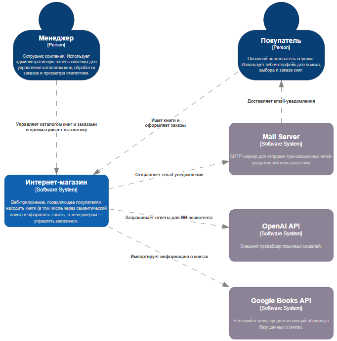
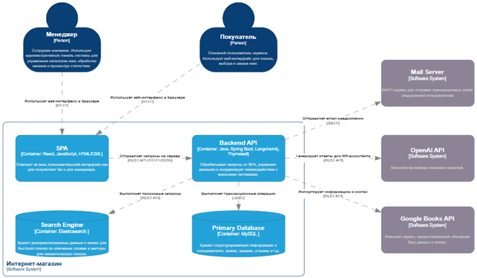
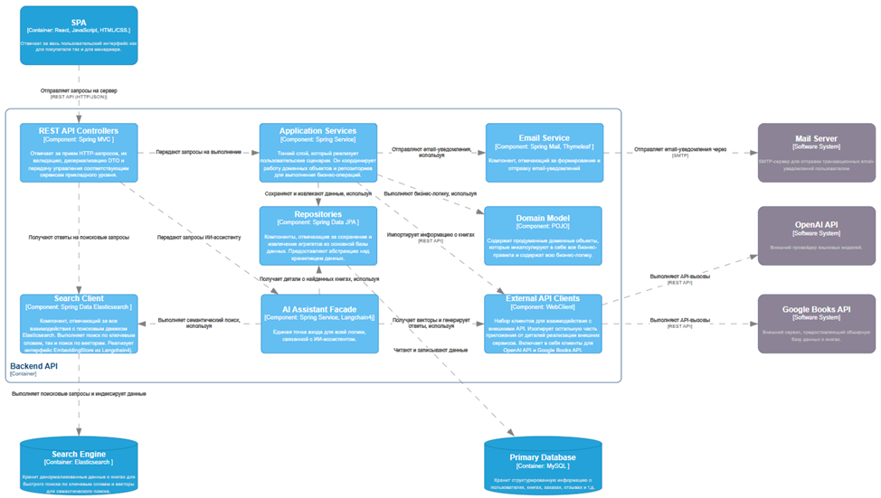
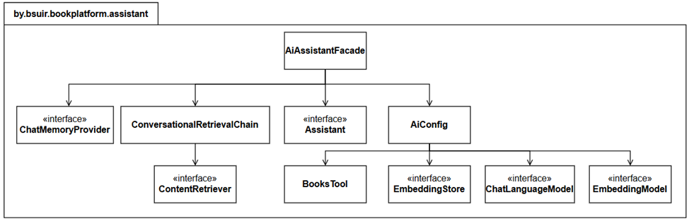
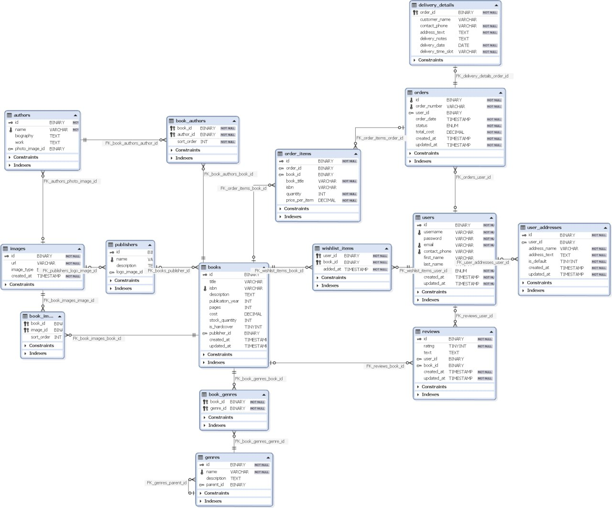

# **BookStore**

Проект представляет собой полнофункциональное веб-приложение для книжного интернет-магазина, ключевой особенностью которого является интегрированный ИИ-ассистент для семантического поиска и подбора книг.

Цель проекта — предложить решение классической проблемы пользователей: поиск книг по нечётким, описательным запросам. В дополнение к традиционному поиску по ключевым словам, интернет-магазин также предлагает интуитивный диалог с ИИ-ассистентом, который понимает смысл и контекст запроса, помогая читателям находить идеальные книги, даже не зная их точного названия или автора.

#### Основные возможности
* **Интеллектуальный поиск с ИИ-ассистентом:**
  * **Семантический поиск:** Возможность искать книги по описанию сюжета, настроению, атмосфере или просто "похожие на..." (реализовано с помощью паттерна RAG - Retrieval-Augmented Generation).
  * **Диалоговый интерфейс:** Общение с чат-ботом, который может отвечать на структурированные вопросы о каталоге (например, "какая книга самая популярная?" или "покажи отзывы") благодаря использованию инструментов (Tools).

* **Классический поиск:**
  * Быстрый полнотекстовый поиск по каталогу (название, автор) с использованием Elasticsearch для обеспечения высокой релевантности и скорости ответа.
* **Управление каталогом:**
  * Просмотр, добавление и редактирование книг в административной панели.
  * **Автоматический импорт данных:** Интеграция с **Google Books API** для быстрого добавления новых книг в каталог по названию или ISBN.

* **Пользовательский функционал:**
  * Просмотр детальной информации о каждой книге.
  * Оформление заказа.

* **Функционал менеджера:**
  * Управление заказами.
  * Просмотр статистики по продажам.

#### Сервер: https://github.com/Helltu/BookStoreServer
#### Клиент: https://github.com/Helltu/BookStoreClient

---

## **Содержание**

1. [Архитектура](#Архитектура)
    1. [C4-модель](#C4-модель)
    2. [Схема данных](#Схема_данных)
2. [Функциональные возможности](#Функциональные_возможности)
    1. [Диаграмма вариантов использования(#Диаграмма_вариантов_использования)]
    2. [User-flow диаграммы](#User-flow_диаграммы)
3. [Детали реализации](#Детали_реализации)
    1. [UML-диаграммы](#UML-диаграммы)
    2. [Спецификация API](#Спецификация_API)
    3. [Безопасность](#Безопасность)
    4. [Оценка качества кода](#Оценка_качества_кода)
4. [Тестирование](#Тестирование)
    1. [Unit-тесты](#Unit-тесты)
    2. [Интеграционные тесты](#Интеграционные_тесты)
5. [Установка и  запуск](#installation)
    1. [Манифесты для сборки docker образов](#Манифесты_для_сборки_docker_образов)
    2. [Манифесты для развертывания k8s кластера](#Манифесты_для_развертывания_k8s_кластера)
6. [Лицензия](#Лицензия)
7. [Контакты](#Контакты)

---
## **Архитектура**

### C4-модель

Представленная диаграмма является самым высокоуровневым представлением архитектуры и определяет место проектируемого программного средства в его экосистеме. Диаграмма наглядно демонстрирует границы системы, ее основных пользователей и ключевые зависимости от внешних программных систем.

Центральным элементом диаграммы является разрабатываемое программное средство – «Интернет-магазин». Это веб-приложение, спроектированное для того, чтобы предоставить покупателям инновационный способ поиска книг, а менеджерам – удобные инструменты для управления магазином.

С программным средством взаимодействуют два типа пользователей. Основным является покупатель, который использует публичный веб-интерфейс, чтобы искать книги и оформлять заказы. Для внутренних бизнес-процессов предусмотрена роль менеджера – сотрудника компании, который через административную панель управляет каталогом книг и заказами, а также имеет возможность просмотра статистики.

Для реализации своей ключевой функциональности программное средство тесно интегрировано с рядом внешних сервисов. Для обеспечения интеллектуального поиска и работы ИИ-ассистента, программное средство обращается к внешнему провайдеру языковых моделей – OpenAI API, чтобы генерировать ответы и обрабатывать запросы на естественном языке. Процесс наполнения каталога автоматизирован за счет взаимодействия с Google Books API, откуда система импортирует подробную информацию о книгах. Для коммуникации с пользователями, например, для отправки подтверждения о создании заказа, система использует внешний почтовый сервер (Mail Server), который отправляет email-уведомления и доставляет их в почтовый ящик покупателя.

Данная диаграмма детализирует внутреннюю структуру программного средства, раскрывая его высокоуровневую архитектуру. Она показывает основные исполняемые единицы и хранилища данных (контейнеры), из которых состоит программное средство, их технологический стек и принципы взаимо-действия.

Архитектура программного средства основана на разделении клиентской и серверной частей. Пользователи, как покупатель, так и менеджер, взаимодействуют с программным средством через SPA (Single-Page Application) – клиентское приложение, работающее в их веб-браузере. Этот контейнер, разработанный с использованием React, отвечает за весь пользовательский интерфейс и отправляет REST API запросы на сервер.

Все запросы от SPA обрабатываются центральным контейнером – Backend API. Это серверное приложение, написанное на Java с использованием фреймворка Spring Boot, является «мозгом» всего программного средства. Оно реализует всю бизнес-логику, управляет данными и координирует взаимодействие с другими контейнерами и внешними системами.

Для хранения данных используются два специализированных контейнера. Primary Database, реализованная на базе MySQL, выступает в роли основного хранилища и «источником правды». Она хранит всю структурированную информацию о пользователях, книгах, заказах и отзывах. Backend API выполняет транзакционные операции с этой базой данных с использованием технологии JDBC. В свою очередь, для реализации продвинутых поисковых возможностей используется отдельный контейнер – Search Engine, реализованный на базе Elasticsearch. Он хранит денормализованные данные о книгах, оптимизированные для быстрого поиска как по ключевым словам, так и по векторам для семантического поиска. Backend API при обращении к данному контейнеру отвечает за выполнение поисковые запросов.

Backend API также является точкой интеграции с внешними системами. Для обеспечения работы ИИ-ассистента он обращается к OpenAI API, для наполнения каталога – к Google Books API, откуда импортирует подробную информацию о книгах, а для отправки уведомлений – к внешнему Mail Server (по протоколу SMTP).

Данная диаграмма детализирует внутреннюю архитектуру ключевого контейнера системы – Backend API. Она раскрывает его внутреннюю структуру, показывая основные логические компоненты, их обязанности и технологическую реализацию, а также то, как они взаимодействуют для выполнения бизнес-задач.

Взаимодействие с внешним миром начинается с компонента REST API Controllers. Этот компонент, реализованный на базе Spring MVC, служит точкой входа для всех запросов от клиентского приложения SPA. Его основная задача – принимать HTTP-запросы, проводить их первичную валидацию и передавать запросы на выполнение соответствующим компонентам прикладного уровня.

Для реализации пользовательских сценариев, не связанных с ИИ, используется компонент Application Services. Этот тонкий слой координирует выполнение бизнес-операций. Он выполняет бизнес-логику, обращаясь к компоненту Domain Model, где инкапсулированы все бизнес-правила согласно принципам Domain-Driven Design (DDD). Для сохранения и извлечения данных агрегатов Application Services сохраняют и извлекают данные, используя компонент Repositories (JPA), который абстрагирует работу с Primary Database (MySQL).

Вся логика, связанная с ИИ-ассистентом, инкапсулирована в компоненте AI Assistant Facade. Он получает запросы от контроллеров и, в зависимости от их характера, использует либо семантический поиск, либо «агентный» подход. Для семантического поиска AI Assistant Facade выполняет семантический поиск, обращаясь к компоненту Search Client. Search Client, в свою очередь, получает ответы на поисковые запросы, взаимодействуя с контейнером Search Engine. Для обогащения ответа AI Assistant Facade получает детали о найденных книгах, используя Repositories (JPA).

Для ответов на структурированные, фактические запросы (например, «какая книга самая популярная?» или «какие отзывы у книги...») AI Assistant Facade использует «агентный» подход. В этом сценарии ИИ-ассистент выступает в роли «диспетчера»: он анализирует запрос пользователя и определяет, какой из методов-инструментов, предоставленных компонентом BooksTool, необходимо вызвать для получения ответа. BooksTool, в свою очередь, выполняет конкретную бизнес-операцию, взаимодействуя с Repositories (JPA) для получения точных данных из Primary Database. Полученный от инструмента результат затем используется ИИ-ассистентом для формирования финального, осмысленного ответа пользователю.

Взаимодействие со всеми внешними системами изолировано в отдельных компонентах. External API Clients, реализованные на базе Spring WebClient, выполняют API-вызовы к OpenAI API и Google Books API, чтобы получать векторы и генерировать ответы или импортировать информацию о книгах. Компонент Email Service отвечает за отправку уведомлений: Application Services отправляют email-уведомления, используя этот сервис, который, в свою очередь, взаимодействует с внешним Mail Server.

Такая компонентная структура четко разделяет обязанности, изолирует бизнес-логику от инфраструктурных деталей и обеспечивает высокую модульность и тестируемость программного средства.

Данная диаграмма представляет собой детализацию компонентного уровня и раскрывает внутреннюю структуру ключевого компонента AI Assistant Facade. Она соответствует упрощенной диаграмме классов в нотации UML и предназначена для разъяснения, как именно реализована сложная логика ИИ-ассистента на уровне кода, какие классы и интерфейсы задействованы и как они взаимодействуют.

Был выбран именно компонент AI Assistant Facade, поскольку он является ядром инновационной функциональности программного средства и обладает наибольшей архитектурной сложностью. В отличие от других компонентов, его реализация нетривиальна и включает в себя организацию множества взаимодействий между различными частями системы для реализации ключевой функциональности. Диаграмма кодового уровня для этого компонента имеет наивысшую ценность, так как она визуализирует неочевидную внутреннюю логику, демонстрируя, как именно сосуществуют и координируются механизмы Retrieval-Augmented Generation (RAG) для семантического поиска и механизм вызова сервисных функций для структурированных запросов. Таким образом, детализация AI Assistant Facade превращает «черный ящик» ИИ-логики в понятную схему, что критически важно для понимания самой сложной и уникальной части программного средства.

Центральным элементом является класс AiAssistantFacade, который служит точкой входа и делегирует выполнение задач двум разным механизмам в зависимости от типа запроса пользователя.

Первый механизм представлен интерфейсом Assistant, который отвечает за обработку структурированных запросов путем вызова предопределенных функций. Его реализация, создаваемая с помощью библиотеки Langchain4j, использует класс BooksTool, предоставляющий набор конкретных методов-инструментов для получения фактической информации из базы данных.

Второй механизм – ConversationalRetrievalChain – это класс, реализующий подход Retrieval-Augmented Generation (RAG) для семантического поиска по описательным запросам. Для своей работы он зависит от интерфейса ContentRetriever, который отвечает за извлечение релевантного контекста.

Создание и конфигурация этих сложных объектов инкапсулированы в классе AiConfig. Этот класс действует как «фабрика», которая собирает все необходимые зависимости для построения Assistant и ConversationalRetrievalChain. Он зависит от набора ключевых интерфейсов-абстракций Langchain4j:
- ChatLanguageModel: контракт для взаимодействия с чат-моделью;
- EmbeddingModel: контракт для преобразования текста в векторы;
- EmbeddingStore: контракт для взаимодействия с векторным хранилищем.

Эти интерфейсы являются «портами», реализации которых предоставляются другими компонентами системы (External API Clients и Search Client), что позволяет компоненту AI Assistant Facade оставаться независимым от конкретных внешних технологий. Также для управления диалогами AiAssistantFacade использует интерфейс ChatMemoryProvider.

Таким образом, кодовый уровень диаграммы наглядно демонстрирует, как с помощью принципа инверсии зависимостей и четкого разделения обязанностей между классами реализуется сложная, но модульная и расширяемая архитектура ИИ-ассистента.

### Схема данных

Ниже представлена физическая схема спроектированной базы данных.

---

## **Функциональные возможности**

### Диаграмма вариантов использования

Диаграмма вариантов использования и ее описание

### User-flow диаграммы

Описание переходов между части ПС для всех ролей из диаграммы ВИ (название ролей должны совпадать с тем, что указано на c4-модели и диаграмме вариантов использования)

---

## **Детали реализации**

### UML-диаграммы

Представить все UML-диаграммы , которые позволят более точно понять структуру и детали реализации ПС

### Спецификация API

Представить описание реализованных функциональных возможностей ПС с использованием Open API (можно представить либо полный файл спецификации, либо ссылку на него)

### Безопасность

Описать подходы, использованные для обеспечения безопасности, включая описание процессов аутентификации и авторизации с примерами кода из репозитория сервера

### Оценка качества кода

Используя показатели качества и метрики кода, оценить его качество

---

## **Тестирование**

### Unit-тесты

Представить код тестов для пяти методов и его пояснение

### Интеграционные тесты

Представить код тестов и его пояснение

---

## **Установка и  запуск**

### Манифесты для сборки docker образов

Представить весь код манифестов или ссылки на файлы с ними (при необходимости снабдить комментариями)

### Манифесты для развертывания k8s кластера

Представить весь код манифестов или ссылки на файлы с ними (при необходимости снабдить комментариями)

---

## **Лицензия**

Этот проект лицензирован по лицензии MIT - подробности представлены в файле [LICENSE.md](./LICENSE.md)

---

## **Контакты**

Коршов Матвей Игоревич: korsovm@gmail.com
